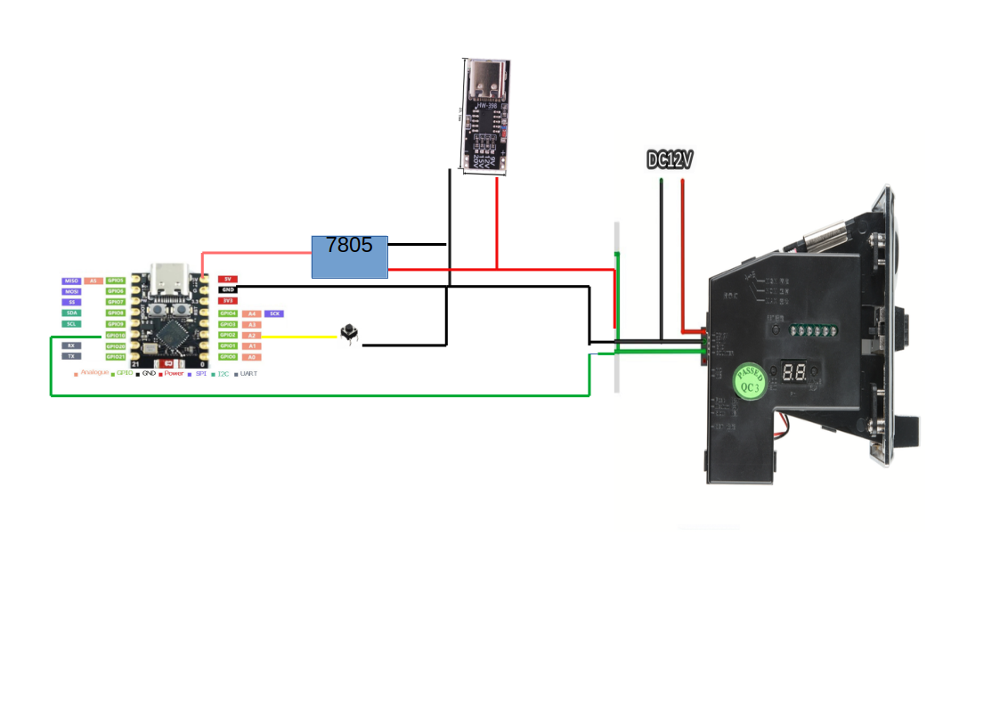

# Program to make a http get request when coins are inserted in a coin acceptor

## Parts used

* ESP32-C3 Supermini
* 616 coin acceptor
* USB PD trigger 
* 7805 voltage regulator
* small push button

